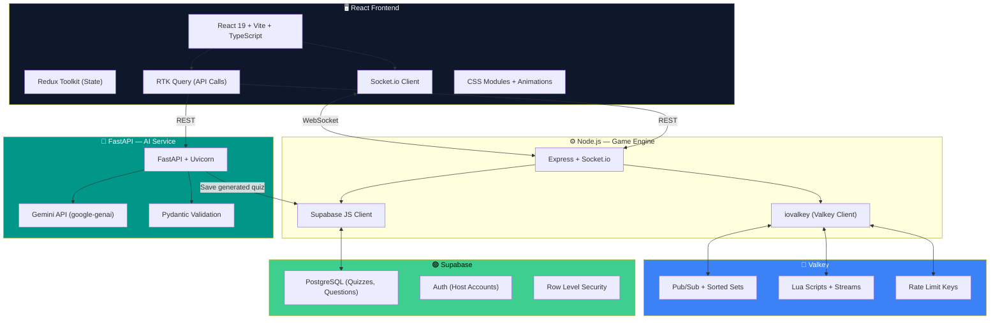
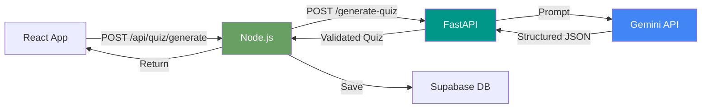

# 🏗️ Implementation Plan — ValQuiz (Final Revision)

> **Hackathon Project**: A Valkey-powered, real-time quiz platform that fixes every high-severity Kahoot flaw.
> **Developer Profile**: MERN stack (3+ yrs), AI experience.
> **Mandatory**: React (frontend) + Node.js (backend) + Valkey (real-time)
> **Revised**: Supabase instead of MongoDB, Redux Toolkit instead of Zustand, FastAPI as AI microservice, no Framer Motion.

# Robust Socket Reconnection & Sync Recovery Plan

## Problem
In the previous deployment, we migrated from Firestore sync to Socket.IO + Valkey. However, two critical issues prevent it from working reliably in production on Hugging Face:
1. **HTTP Handshake / Polling Transport Failure (503)**: Hugging Face proxy blocks long-polling handshakes (`polling` transport), resulting in `503 Service Unavailable` errors.
2. **Socket Disconnect/Reconnect State Loss**: When a client (host or player) disconnects and reconnects (a frequent event under proxy setups), their socket ID changes. Since the server maps roles (`host`/`player`) and nicknames to the connection's `socket.id` (stored only during the initial `host:create` or `player:join` events), the reconnected socket loses its identity.
   - For hosts: Emitting `host:start` is ignored silently because the server no longer recognizes them as the host (`session?.role !== 'host'`).
   - For players: They do not receive `game:start` or `question:new` broadcasts because they never rejoin the room `game:${pin}` or `player:${pin}:${nickname}` upon reconnection.

## Proposed Changes

### 1. Client — Socket Service
#### [MODIFY] [socket.ts](file:///c:/Users/ADMIN/Desktop/VALKEY-HACKATON/client/src/services/socket.ts)
- Change `transports: ['polling', 'websocket']` to `transports: ['websocket']` to enforce direct WebSocket connections, bypassing HF proxy's 503 issues on long-polling handshake.
- Auto-reassociate on connect/reconnect: When the socket connects/reconnects, automatically emit `game:request-sync` with the stored PIN, nickname, and role if they exist.

### 2. Server — Socket Handlers
#### [MODIFY] [handlers.ts](file:///c:/Users/ADMIN/Desktop/VALKEY-HACKATON/server/src/socket/handlers.ts)
- Modify the `game:request-sync` handler:
  - Accept `{ pin, nickname, role }` from the client.
  - Re-register the socket in `socketMap` with the correct `role`, `pin`, and `nickname`.
  - Rejoin the client socket to the correct rooms: `game:${pin}`, and either `host:${pin}` or `player:${pin}:${nickname}`.
  - If a player, update the socket ID in Valkey using `GameManager.updatePlayerSocket(pin, nickname, socket.id)`.
  - Calculate `secondsLeft` for the current question using `questionStartTime` in Valkey, and pass it in the `question` object (overriding `timeLimit`) so the client timer resumes from the correct remaining time.
- Modify `sendQuestion` helper:
  - Store the current question's start time in Valkey: `await v.hSet('game:pin:config', 'questionStartTime', Date.now().toString())`.

### 3. Client — Game Pages State Sync & Reassociation
#### [MODIFY] [PlayerLobby.tsx](file:///c:/Users/ADMIN/Desktop/VALKEY-HACKATON/client/src/pages/Play/PlayerLobby.tsx)
- Pass `{ pin: activePin, nickname, role: 'player' }` when emitting `game:request-sync`.

#### [MODIFY] [PlayerQuestion.tsx](file:///c:/Users/ADMIN/Desktop/VALKEY-HACKATON/client/src/pages/Play/PlayerQuestion.tsx)
- Emit `game:request-sync` on mount/reconnect: `socketService.emit('game:request-sync', { pin, nickname, role: 'player' })`.
- Add a listener for `game:state-sync` that updates the question text, options, and remaining time (`timeLimit` derived from `secondsLeft` sent by the server).

#### [MODIFY] [HostLobby.tsx](file:///c:/Users/ADMIN/Desktop/VALKEY-HACKATON/client/src/pages/Host/HostLobby.tsx)
- Pass `{ pin, role: 'host' }` when emitting `game:request-sync`.

#### [MODIFY] [HostQuestion.tsx](file:///c:/Users/ADMIN/Desktop/VALKEY-HACKATON/client/src/pages/Host/HostQuestion.tsx)
- Emit `game:request-sync` on mount/reconnect: `socketService.emit('game:request-sync', { pin, role: 'host' })`.
- Listen for `game:state-sync` to re-sync the answers count and other metrics.

#### [MODIFY] [HostLeaderboard.tsx](file:///c:/Users/ADMIN/Desktop/VALKEY-HACKATON/client/src/pages/Host/HostLeaderboard.tsx)
- Emit `game:request-sync` on mount: `socketService.emit('game:request-sync', { pin, role: 'host' })`.

## Verification Plan

### Automated/Local Tests
- Run backend locally and simulate host and player connections.
- Manually disconnect sockets and verify that they rejoin rooms and resume state (timers, roles, answer count) instantly upon reconnection.

### Manual Verification
- Deploy to Hugging Face and Vercel.
- Verify that clients no longer throw `503 Service Unavailable` on connection.
- Verify that when the host starts the game, the player screen transitions immediately to the question screen.
- Verify that refreshing either the host or player page does not break the session.

---

## Tech Stack — Final



---

## Why This Stack — Decision Rationale

| Decision | Why |
|---|---|
| **Supabase over MongoDB** | PostgreSQL with proper relations (quiz → questions), built-in Auth, RLS for security, Realtime subscriptions, free tier with generous limits, no server to manage |
| **Redux Toolkit over Zustand** | You know Redux from MERN. RTK reduces boilerplate with `createSlice`. RTK Query handles API caching. Better DevTools for debugging real-time state |
| **CSS Animations over Framer** | Zero extra dependency. CSS `@keyframes` + `transition` handle leaderboard bars, countdowns, podium reveals. Lighter bundle |
| **FastAPI as AI Microservice** | See section below 👇 |

---

## 🐍 The Role of FastAPI — AI Microservice

FastAPI isn't replacing Node.js. It runs **alongside** Node.js as a **dedicated AI service**. Here's why this is the right architecture:



### Why FastAPI for AI (not Node.js)?

| Reason | Detail |
|---|---|
| **Python AI Ecosystem** | `google-genai` SDK, LangChain, prompt templates — all Python-native. You have AI experience, so this is your strength |
| **Pydantic Validation** | Auto-validates Gemini's JSON output against a strict schema. If the AI returns malformed data, Pydantic catches it before it hits your DB |
| **Auto API Docs** | FastAPI generates Swagger UI at `/docs` automatically. Your Node.js backend knows exactly how to call it |
| **Async by Default** | `async/await` handles concurrent quiz generation requests without blocking |
| **Separation of Concerns** | AI logic is isolated. You can swap Gemini for another model without touching game code |
| **Hackathon Bonus** | Judges love seeing a **polyglot microservice architecture** — it shows real engineering maturity |

### What FastAPI Handles

| Endpoint | Purpose |
|---|---|
| `POST /generate-quiz` | Generate quiz from a topic string via Gemini |
| `POST /generate-from-text` | Generate quiz from pasted text/paragraph |
| `POST /generate-explanation` | Generate explanations for existing questions |
| `GET /health` | Health check for Docker Compose |

### What FastAPI Does NOT Handle
- ❌ Real-time game logic (that's Node.js + Valkey)
- ❌ Player connections (that's Socket.io)
- ❌ Scoring / leaderboards (that's Valkey Lua scripts)
- ❌ Auth (that's Supabase Auth)

---

## Dual-Backend Responsibility Split

| Concern | Node.js (Game Engine) | FastAPI (AI Service) |
|---|---|---|
| **Real-time game state** | ✅ Socket.io + Valkey | ❌ |
| **Player connections** | ✅ Socket.io rooms | ❌ |
| **Scoring** | ✅ Valkey Lua scripts | ❌ |
| **Leaderboard** | ✅ Valkey Sorted Sets | ❌ |
| **Anti-bot** | ✅ Valkey rate limiting | ❌ |
| **Quiz CRUD** | ✅ Supabase client | ❌ |
| **AI quiz generation** | Proxy request → | ✅ Gemini API + Pydantic |
| **Auth** | ✅ Supabase Auth | ❌ |
| **Swagger docs** | ❌ | ✅ Auto-generated |

---

## Supabase Schema (PostgreSQL)

```sql
-- Quizzes table
CREATE TABLE quizzes (
    id UUID DEFAULT gen_random_uuid() PRIMARY KEY,
    title TEXT NOT NULL,
    description TEXT,
    cover_image TEXT,
    created_by UUID REFERENCES auth.users(id),
    ai_generated BOOLEAN DEFAULT false,
    tags TEXT[] DEFAULT '{}',
    created_at TIMESTAMPTZ DEFAULT now()
);

-- Questions table
CREATE TABLE questions (
    id UUID DEFAULT gen_random_uuid() PRIMARY KEY,
    quiz_id UUID REFERENCES quizzes(id) ON DELETE CASCADE,
    sort_order INTEGER NOT NULL,
    type TEXT CHECK (type IN ('mcq', 'truefalse', 'open', 'ordering', 'poll')) NOT NULL,
    text TEXT NOT NULL,                        -- no character limit!
    media_url TEXT,
    media_type TEXT CHECK (media_type IN ('image', 'video')),
    options JSONB DEFAULT '[]',                -- [{id, text}]
    correct JSONB DEFAULT '[]',                -- ["A"] or ["A","C"] for multi
    explanation TEXT,                           -- shown after answering
    difficulty TEXT CHECK (difficulty IN ('easy', 'medium', 'hard')) DEFAULT 'medium',
    time_limit INTEGER DEFAULT 20,             -- seconds (0 = no timer)
    points TEXT CHECK (points IN ('standard', 'double', 'none')) DEFAULT 'standard'
);

-- Game history (optional, for post-game reports)
CREATE TABLE game_sessions (
    id UUID DEFAULT gen_random_uuid() PRIMARY KEY,
    quiz_id UUID REFERENCES quizzes(id),
    pin TEXT NOT NULL,
    mode TEXT CHECK (mode IN ('classic', 'balanced', 'accuracy')) NOT NULL,
    host_id UUID REFERENCES auth.users(id),
    player_count INTEGER DEFAULT 0,
    started_at TIMESTAMPTZ,
    ended_at TIMESTAMPTZ,
    results JSONB DEFAULT '{}'                 -- final leaderboard snapshot
);

-- Row Level Security
ALTER TABLE quizzes ENABLE ROW LEVEL SECURITY;
ALTER TABLE questions ENABLE ROW LEVEL SECURITY;

-- Policies: users can read all quizzes, but only edit their own
CREATE POLICY "Anyone can view quizzes" ON quizzes FOR SELECT USING (true);
CREATE POLICY "Users can create quizzes" ON quizzes FOR INSERT WITH CHECK (auth.uid() = created_by);
CREATE POLICY "Users can edit own quizzes" ON quizzes FOR UPDATE USING (auth.uid() = created_by);
CREATE POLICY "Users can delete own quizzes" ON quizzes FOR DELETE USING (auth.uid() = created_by);

CREATE POLICY "Anyone can view questions" ON questions FOR SELECT USING (true);
CREATE POLICY "Quiz owners can manage questions" ON questions FOR ALL
    USING (quiz_id IN (SELECT id FROM quizzes WHERE created_by = auth.uid()));
```

---

## Valkey Data Model (Unchanged — Still the Real-Time Engine)

| Key Pattern | Type | TTL | Purpose |
|---|---|---|---|
| `game:{pin}:config` | Hash | 2h | Game settings (mode, timer, status, currentQ) |
| `game:{pin}:players` | Hash | 2h | Nickname → socket/device mapping |
| `game:{pin}:latency` | Hash | 2h | Nickname → ping in ms |
| `game:{pin}:leaderboard` | Sorted Set | 2h | Nickname → total score |
| `game:{pin}:streaks` | Hash | 2h | Nickname → consecutive correct count |
| `game:{pin}:q:{n}:answers` | Stream | 2h | Durable answer queue per question |
| `game:{pin}:fingerprints` | Set | 2h | Device fingerprint dedup |
| `rate:join:{ip}` | String | 10s | Anti-bot rate limit counter |
| `game:{pin}:events` | Pub/Sub | — | Real-time broadcast channel |

---

## Redux Toolkit — Store Design

```typescript
// store/index.ts
import { configureStore } from '@reduxjs/toolkit';
import gameReducer from './gameSlice';
import playerReducer from './playerSlice';
import socketReducer from './socketSlice';
import { quizApi } from './quizApi';

export const store = configureStore({
    reducer: {
        game: gameReducer,
        player: playerReducer,
        socket: socketReducer,
        [quizApi.reducerPath]: quizApi.reducer,
    },
    middleware: (getDefault) =>
        getDefault().concat(quizApi.middleware),
});
```

### Slices

| Slice | State Fields | Key Actions |
|---|---|---|
| **gameSlice** | `pin, status, mode, currentQuestion, totalQuestions, questions[], timerConfig` | `setPin`, `setStatus`, `nextQuestion`, `resetGame` |
| **playerSlice** | `nickname, score, rank, streak, isCorrect, lastScore` | `setNickname`, `updateScore`, `updateRank`, `resetStreak` |
| **socketSlice** | `connected, latency, error` | `setConnected`, `setLatency`, `setError` |
| **quizApi** (RTK Query) | Cached API responses | `useGenerateQuizMutation`, `useGetQuizQuery`, `useCreateQuizMutation` |

### RTK Query — API Service

```typescript
// store/quizApi.ts
import { createApi, fetchBaseQuery } from '@reduxjs/toolkit/query/react';

export const quizApi = createApi({
    reducerPath: 'quizApi',
    baseQuery: fetchBaseQuery({ baseUrl: '/api' }),
    endpoints: (builder) => ({
        // Calls Node.js → FastAPI → Gemini
        generateQuiz: builder.mutation({
            query: (body) => ({ url: '/quiz/generate', method: 'POST', body }),
        }),
        getQuiz: builder.query({
            query: (id) => `/quiz/${id}`,
        }),
        createQuiz: builder.mutation({
            query: (body) => ({ url: '/quiz', method: 'POST', body }),
        }),
    }),
});
```

---

## Project File Structure

```
valquiz/
├── docker-compose.yml                  # 4 containers: React, Node, FastAPI, Valkey
│
├── client/                             # React + Vite + TypeScript
│   ├── vite.config.ts
│   ├── package.json
│   ├── index.html
│   └── src/
│       ├── main.tsx
│       ├── App.tsx                     # React Router
│       ├── store/
│       │   ├── index.ts               # configureStore
│       │   ├── gameSlice.ts           # Game state
│       │   ├── playerSlice.ts         # Player state
│       │   ├── socketSlice.ts         # Connection state
│       │   └── quizApi.ts             # RTK Query endpoints
│       ├── services/
│       │   ├── socket.ts              # Socket.io client singleton
│       │   └── supabase.ts            # Supabase client (for auth)
│       ├── hooks/
│       │   ├── useSocket.ts           # Socket event hook
│       │   ├── useTimer.ts            # Countdown hook
│       │   └── useLatency.ts          # Ping measurement
│       ├── pages/
│       │   ├── Home/HomePage.tsx
│       │   ├── Host/
│       │   │   ├── HostLobby.tsx
│       │   │   ├── HostQuestion.tsx
│       │   │   ├── HostResults.tsx
│       │   │   ├── HostLeaderboard.tsx
│       │   │   └── HostPodium.tsx
│       │   ├── Play/
│       │   │   ├── JoinGame.tsx
│       │   │   ├── PlayerLobby.tsx
│       │   │   ├── PlayerQuestion.tsx
│       │   │   ├── PlayerFeedback.tsx
│       │   │   └── PlayerPodium.tsx
│       │   └── Create/
│       │       ├── CreateQuiz.tsx
│       │       └── AIGenerate.tsx
│       ├── components/
│       │   ├── Timer/CountdownTimer.tsx
│       │   ├── Leaderboard/LeaderboardBar.tsx
│       │   ├── Podium/PodiumStage.tsx
│       │   ├── Question/AnswerButton.tsx
│       │   ├── Question/QuestionCard.tsx
│       │   ├── charts/AnswerDistribution.tsx
│       │   └── common/
│       │       ├── Button.tsx
│       │       ├── Modal.tsx
│       │       ├── ThemeToggle.tsx
│       │       └── AccessibilityBar.tsx
│       ├── styles/
│       │   ├── variables.css
│       │   ├── global.css
│       │   └── animations.css          # CSS @keyframes (no Framer)
│       └── types/
│           ├── game.ts
│           └── socket.ts
│
├── server/                             # Node.js Game Engine
│   ├── package.json
│   ├── tsconfig.json
│   ├── src/
│   │   ├── index.ts                   # Express + Socket.io entry
│   │   ├── config/
│   │   │   ├── valkey.ts              # iovalkey client
│   │   │   ├── supabase.ts            # Supabase server client
│   │   │   └── env.ts
│   │   ├── socket/
│   │   │   ├── handlers.ts            # Socket event handlers
│   │   │   ├── middleware.ts          # Rate limit + auth middleware
│   │   │   └── events.ts             # Event name constants
│   │   ├── game/
│   │   │   ├── GameManager.ts         # Game lifecycle
│   │   │   ├── ScoringEngine.ts       # Valkey Lua scoring
│   │   │   ├── AntiBotGuard.ts        # Rate limit + fingerprint
│   │   │   └── LeaderboardService.ts  # ZSET operations
│   │   ├── routes/
│   │   │   ├── index.ts
│   │   │   └── quizRoutes.ts          # CRUD + proxy to FastAPI
│   │   ├── lua/
│   │   │   ├── calculateScore.lua
│   │   │   └── rateLimit.lua
│   │   └── types/
│   │       └── index.ts
│   └── Dockerfile
│
├── ai-service/                         # FastAPI AI Microservice
│   ├── requirements.txt
│   ├── main.py                        # FastAPI app
│   ├── schemas.py                     # Pydantic models
│   ├── generator.py                   # Gemini API logic
│   ├── config.py                      # Environment config
│   └── Dockerfile
│
└── README.md
```

---

## FastAPI Service — Full Design

### `ai-service/schemas.py`
```python
from pydantic import BaseModel, Field

class QuizRequest(BaseModel):
    topic: str = Field(..., min_length=2, max_length=200)
    num_questions: int = Field(default=10, ge=3, le=30)
    difficulty: str = Field(default="medium")  # easy, medium, hard, mixed

class TextQuizRequest(BaseModel):
    text: str = Field(..., min_length=50, max_length=10000)
    num_questions: int = Field(default=10, ge=3, le=30)

class QuestionOut(BaseModel):
    text: str
    type: str                    # mcq, truefalse
    options: list[dict]          # [{id: "A", text: "..."}, ...]
    correct: list[str]           # ["B"]
    explanation: str
    difficulty: str

class QuizResponse(BaseModel):
    questions: list[QuestionOut]
    topic: str
    generated_count: int
```

### `ai-service/main.py`
```python
from fastapi import FastAPI, HTTPException
from fastapi.middleware.cors import CORSMiddleware
from schemas import QuizRequest, TextQuizRequest, QuizResponse
from generator import generate_from_topic, generate_from_text

app = FastAPI(title="ValQuiz AI Service", version="1.0.0")

app.add_middleware(CORSMiddleware, allow_origins=["*"], allow_methods=["*"])

@app.post("/generate-quiz", response_model=QuizResponse)
async def gen_quiz(req: QuizRequest):
    try:
        questions = await generate_from_topic(req.topic, req.num_questions, req.difficulty)
        return QuizResponse(questions=questions, topic=req.topic, generated_count=len(questions))
    except Exception as e:
        raise HTTPException(status_code=500, detail=str(e))

@app.post("/generate-from-text", response_model=QuizResponse)
async def gen_from_text(req: TextQuizRequest):
    try:
        questions = await generate_from_text(req.text, req.num_questions)
        return QuizResponse(questions=questions, topic="Custom Text", generated_count=len(questions))
    except Exception as e:
        raise HTTPException(status_code=500, detail=str(e))

@app.get("/health")
async def health():
    return {"status": "ok", "service": "ai-service"}
```

---

## Docker Compose — 4 Containers

```yaml
version: "3.9"
services:
  client:
    build: ./client
    ports:
      - "5173:5173"
    depends_on:
      - server

  server:
    build: ./server
    ports:
      - "3000:3000"
    environment:
      - VALKEY_URL=valkey://valkey:6379
      - SUPABASE_URL=${SUPABASE_URL}
      - SUPABASE_SERVICE_KEY=${SUPABASE_SERVICE_KEY}
      - FASTAPI_URL=http://ai-service:8000
    depends_on:
      - valkey
      - ai-service

  ai-service:
    build: ./ai-service
    ports:
      - "8000:8000"
    environment:
      - GEMINI_API_KEY=${GEMINI_API_KEY}

  valkey:
    image: valkey/valkey:8.0-alpine
    ports:
      - "6379:6379"
    command: valkey-server --maxmemory 256mb --maxmemory-policy allkeys-lru
```

> [!NOTE]
> **Supabase is cloud-hosted** (free tier) — no container needed. You create a project at [supabase.com](https://supabase.com) and use the URL + keys.

---

## Implementation Phases

### Phase 1: Foundation ⏱️ ~1.5 hours
- [ ] `npx create-vite client --template react-ts`
- [ ] Set up Node.js + Express + Socket.io server
- [ ] Set up FastAPI service (`main.py` + `schemas.py`)
- [ ] Docker Compose with Valkey container
- [ ] Connect `iovalkey` (Node → Valkey)
- [ ] Create Supabase project + run SQL schema
- [ ] Connect Supabase clients (Node + React)
- [ ] Redux Toolkit store scaffolding

### Phase 2: Game Engine (Node.js + Valkey) ⏱️ ~2.5 hours
- [ ] `GameManager` — create game (PIN → Valkey Hash)
- [ ] `AntiBotGuard` — rate limiter + fingerprint dedup
- [ ] Player join flow with Socket.io rooms
- [ ] Latency measurement (ping/pong)
- [ ] `ScoringEngine` — Lua script (latency-compensated, 3 modes)
- [ ] `LeaderboardService` — ZADD, ZREVRANGE, ZRANK
- [ ] Streak tracking — HINCRBY
- [ ] Game lifecycle (lobby → playing → finished)
- [ ] Save game results to Supabase `game_sessions`

### Phase 3: React Frontend ⏱️ ~2.5 hours
- [ ] Redux slices (game, player, socket) + RTK Query
- [ ] `HomePage` — Create or Join
- [ ] Host flow: Lobby → Question → Results → Leaderboard → Podium
- [ ] Player flow: Join → Lobby → Question → Feedback → Podium
- [ ] CSS animations: countdown timer, leaderboard bars, podium reveal
- [ ] Dark mode + glassmorphism theme (CSS variables)
- [ ] Accessibility: ARIA, keyboard nav, high-contrast toggle

### Phase 4: AI + Polish ⏱️ ~1.5 hours
- [ ] FastAPI Gemini integration (`generator.py`)
- [ ] Node.js proxy route `/api/quiz/generate` → FastAPI
- [ ] `AIGenerate` page in React (topic input → quiz preview → save)
- [ ] `CreateQuiz` page (manual builder)
- [ ] Supabase Auth (optional: Google sign-in for hosts)
- [ ] Error handling + socket reconnection
- [ ] README with architecture diagram + demo instructions

---

## All 9 Kahoot Flaws — Rectified

| # | Kahoot Flaw | 🔴 | ValQuiz Fix | Stack Component |
|---|---|---|---|---|
| 1 | Speed over depth | High | 3 scoring modes (Balanced = 30% speed) | **Valkey** Lua + Hash |
| 2 | Competitive stress | High | Private leaderboard (own rank only) | **Valkey** ZRANK |
| 3 | 10-player cap | High | No limit, open source | **Valkey** Sorted Set |
| 4 | Paywalled features | High | Everything free | Open source |
| 5 | Internet dependency | High | Durable answer queue + auto-reconnect | **Valkey** Streams + **Socket.io** |
| 6 | Device inequality | High | Questions on player screen, responsive | **Valkey** Pub/Sub → **React** |
| 7 | Latency unfairness | High | Subtract player ping from response time | **Valkey** Lua script |
| 8 | Bot flooding | High | 5 joins/IP/10s + fingerprint dedup | **Valkey** INCR + SADD |
| 9 | Timer pressure | High | Configurable + think buffer + no-timer | **Valkey** Hash + Pub/Sub |
| 🆕 | No AI generation | — | Generate quiz from any topic or text | **FastAPI** + Gemini |
| 🆕 | No proper auth | — | Google/GitHub sign-in for hosts | **Supabase** Auth |
| 🆕 | No data security | — | Row Level Security on all tables | **Supabase** RLS |

---

## Open Questions

> [!IMPORTANT]
> **Before I start coding:**
> 1. **Do you have Docker installed?** (Needed for Valkey + FastAPI containers)
> 2. **Do you have a Supabase account?** (Free tier at supabase.com)
> 3. **Do you have a Gemini API key?** (For AI quiz generation)
> 4. **How many hours** do you have left in the hackathon?
> 5. Keep the name **ValQuiz** or change it?

---

*Approve and I'll start building all 3 services immediately! 🚀*
