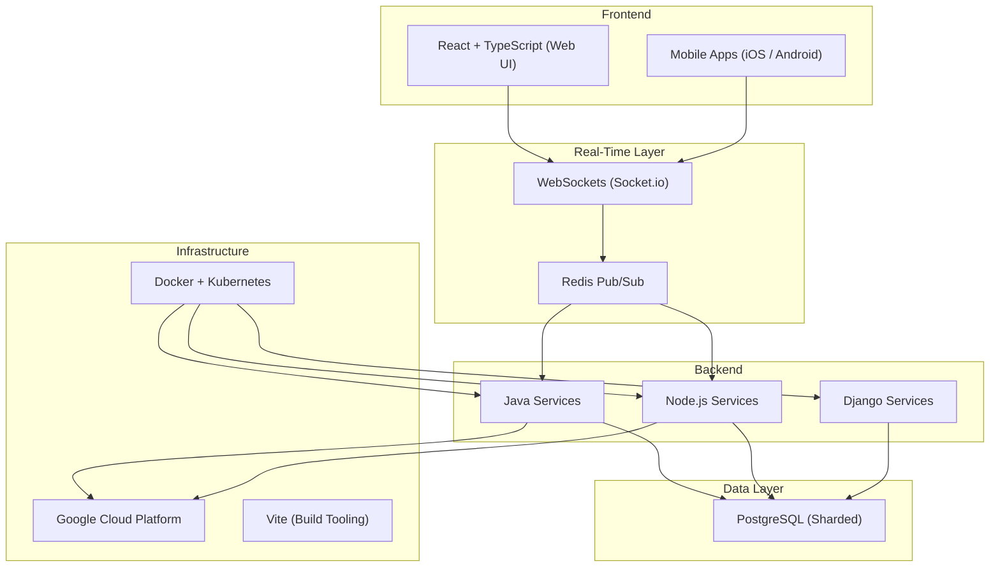
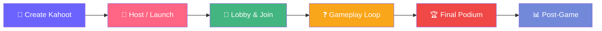
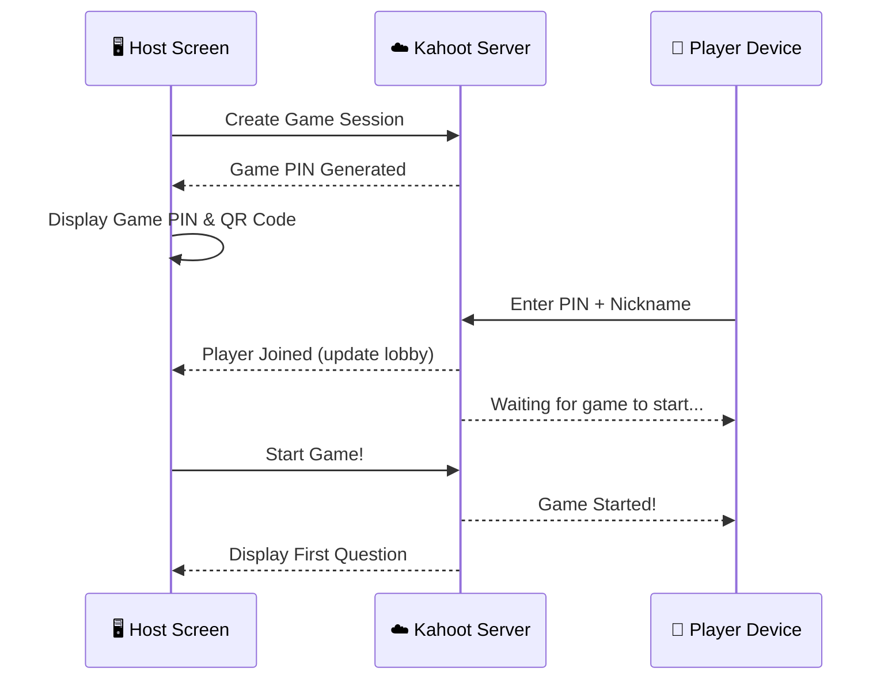
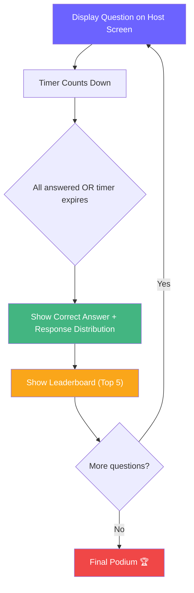
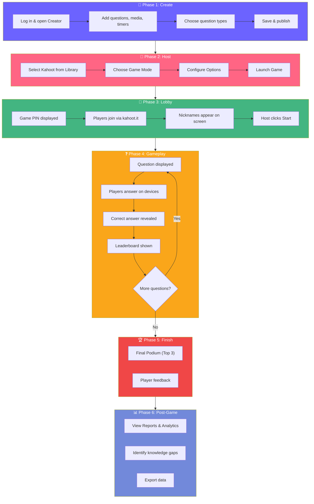

# 📋 Kahoot! — Full Platform Report

> A comprehensive deep-dive into the Kahoot! platform: its architecture, complete game workflow (from hosting to final leaderboards), scoring mechanics, question types, and post-game analytics.

---

## 1. Platform Architecture & Technology

Kahoot! is a **cloud-based, real-time** platform designed to handle millions of concurrent users with low-latency gameplay.



| Layer | Technology | Purpose |
|---|---|---|
| **Cloud** | Google Cloud Platform | Global scaling, security, delivery |
| **Backend** | Java, Node.js, Django | Data management, real-time interactions |
| **Frontend** | React + TypeScript | Responsive, interactive UI |
| **Real-Time** | WebSockets (Socket.io) + Redis | Low-latency host ↔ player sync |
| **Database** | PostgreSQL (sharded) | Strong consistency for scores/reports |
| **DevOps** | Docker + Kubernetes | Microservice orchestration |
| **Build** | Vite | Frontend optimization |

---

## 2. The Two-Screen Experience

Kahoot! operates on a fundamental **two-screen model**:

| Screen | Role | Used By |
|---|---|---|
| **Host Screen** | Displays questions, answer choices, timers, leaderboards. Projected on a shared screen or via video call. | Teacher / Presenter / Host |
| **Player Device** | Used to select answers, view rank, and provide feedback. Can be a phone, tablet, or laptop. | Participants / Students / Players |

> [!IMPORTANT]
> Questions and answer choices appear on the **Host Screen** by default. Players see only the colored answer shapes on their devices. The host can optionally enable "See questions on participant's screen" in settings.

---

## 3. Complete Game Workflow — End to End

Below is the full lifecycle of a Kahoot! game, from creation through post-game analytics.



---

### Phase 1: 🎨 Create the Kahoot

Before any game can be hosted, a quiz must be created (or selected from the library).

#### Steps:
1. Log in to your Kahoot! account (web or app)
2. Click **"Create"** to open the quiz builder
3. Add a **title**, **description**, and optional **cover image**
4. Add questions one by one, selecting the question type
5. For each question, set:
   - The **question text** (and optional media: images, YouTube videos, diagrams)
   - The **answer choices** and mark the correct one(s)
   - The **time limit** (5s, 10s, 20s, 30s, 60s, 90s, 120s, or 240s)
   - The **point value** (Standard 1000, Double 2000, or No Points)
6. Insert optional **content slides** between questions for context
7. Save and publish

#### Question Types Available:

| Type | Description | Scored? | Plan |
|---|---|---|---|
| **Quiz (Multiple Choice)** | Classic 2–4 answer choices, one correct | ✅ Yes | Free |
| **True / False** | Binary choice question | ✅ Yes | Free |
| **Multi-Select** | Multiple correct answers, partial credit possible | ✅ Yes | Paid |
| **Puzzle** | Arrange items in correct order | ✅ Yes | Paid |
| **Open-Ended** | Short free-text response | ✅ Yes | Paid |
| **Poll** | Gather opinions, no right/wrong | ❌ No | Paid |
| **Word Cloud** | Free-text responses shown as visual cloud | ❌ No | Paid |
| **Brainstorm** | Submit & share ideas freely | ❌ No | Paid |
| **Content Slide** | Informational slide (text, image, video) | ❌ N/A | Free |

> [!TIP]
> **AI-Powered Creation**: Kahoot! now offers AI tools to auto-generate quizzes from topics, PDFs, slide decks, websites, or Wikipedia articles. EDU users can align AI-generated questions with curriculum standards.

---

### Phase 2: 🚀 Host / Launch the Game

Once a Kahoot is ready, the host initiates a live session.

#### Steps:
1. Navigate to **"My Kahoots"** (Library)
2. Select the quiz and click **"Host live"**
3. Choose the **Game Mode**:

| Mode | Description |
|---|---|
| **Classic** | Individual players compete against each other |
| **Team Mode** | Players form teams; scores are averaged across members |
| **Accuracy Experience** | Non-competitive; speed doesn't affect score |

4. Configure **Game Options**:
   - Randomize question order
   - Randomize answer order
   - Enable/disable nickname generator (to prevent inappropriate names)
   - Show/hide questions on player devices
   - Enable/disable answer streak bonus
   - Set lobby music
   - Enable high-contrast mode (accessibility)

5. Click **"Start"** to create the game lobby

---

### Phase 3: 📲 Lobby & Player Join

The lobby is the "waiting room" where players join before gameplay begins.

#### What the Host Screen Shows:
- A unique **Game PIN** (numeric code)
- A **QR Code** for quick joining
- A **shareable link**
- A live list of player **nicknames** as they join

#### How Players Join:
1. Open a browser and go to **`kahoot.it`** — OR — open the **Kahoot! app**
2. Enter the **Game PIN**
3. Choose a **nickname** (or use one from the nickname generator)
4. Wait in the lobby until the host starts the game

> [!NOTE]
> The host can also share the join link via **Google Classroom**, **Microsoft Teams**, or **Remind** integrations.



---

### Phase 4: ❓ Gameplay Loop (Question by Question)

This is the core interactive loop. Each question follows this cycle:



#### Step-by-Step for Each Question:

1. **Question Appears** — The host screen displays the question text, any media (image/video), the answer choices (with colored shapes: 🔴🔵🟡🟢), and a countdown timer
2. **Players Answer** — On their devices, players tap the colored shape matching their answer. The host screen shows how many have answered in real time
3. **Timer Expires (or all answer)** — The question closes
4. **Correct Answer Revealed** — The host screen highlights the correct answer in green and shows a bar chart of how many players chose each option
5. **Teaching Moment** — The host can pause here to discuss the topic, explain the answer, or provide commentary
6. **Leaderboard Displayed** — A scoreboard shows the **Top 5 players** with their current total scores. Celebratory messages appear for:
   - 🔥 **Answer Streaks** (consecutive correct answers)
   - ⬆️ **Rank Movers** (players who jumped up in ranking)
7. **Host Advances** — The host clicks "Next" to proceed to the next question

> [!IMPORTANT]
> **What Players See on Their Devices:**
> - After answering: Whether they were correct or incorrect
> - Their current score
> - Their current rank (if in Top 5; otherwise just their score)
> - Streak status (if applicable)

---

### Phase 5: 🏆 Final Podium & Results

After the last question is answered:

#### The Final Podium Screen:

```
        🥇
       ╔═══╗
       ║ 1 ║
  🥈   ║   ║   🥉
 ╔═══╗ ║   ║ ╔═══╗
 ║ 2 ║ ║   ║ ║ 3 ║
 ╚═══╝ ╚═══╝ ╚═══╝
```

- **Top 3 players** are displayed on a podium with gold, silver, and bronze rankings
- Their **nicknames** and **total scores** are shown
- Celebratory **animations and music** play

#### What Players See:
| Rank | What They See |
|---|---|
| **1st – 5th** | Their specific rank + total score |
| **6th and below** | Their total score only (rank hidden to keep focus on participation) |

---

### Phase 6: 📊 Post-Game Analytics & Feedback

After the podium, the game transitions to the post-game phase.

#### Player Feedback:
- Players are prompted to **rate the game** (fun rating, difficulty, etc.)
- Optional: Players can rate how much they learned

#### Host Reports & Analytics:

Kahoot! automatically generates detailed reports accessible from the **Reports** section of the dashboard.

| Report Feature | Description |
|---|---|
| **Participation Rate** | % of players who completed the entire game |
| **Overall Performance** | Class/group average score |
| **Question-by-Question Breakdown** | See which questions were hardest and easiest |
| **Difficult Questions** | Flagged questions where many players answered incorrectly — ideal for reteaching |
| **Individual Player Data** | View each player's answers, response times, and scores |
| **Download** | Export reports as Excel/CSV files for further analysis |
| **Historical Tracking** | Compare results across multiple sessions over time |

> [!TIP]
> Use the "Difficult Questions" report to identify **knowledge gaps** and plan targeted re-teaching sessions.

---

## 4. Scoring System — Deep Dive

### Classic Mode Formula

$$\text{Points} = \left\lfloor \left(1 - \frac{\text{response\_time}}{\text{question\_timer} \div 2}\right) \times \text{max\_points} \right\rfloor$$

| Parameter | Description | Default |
|---|---|---|
| `response_time` | Time (seconds) the player took to answer | Varies |
| `question_timer` | Total time allowed for the question | 20s (default) |
| `max_points` | Maximum points for the question | 1,000 |

#### Key Rules:

| Rule | Detail |
|---|---|
| **Maximum** | Up to **1,000 points** per question (Standard) or **2,000** (Double) |
| **Minimum** | Correct answers always earn at least **50%** of max points (i.e., 500 in Standard) |
| **Incorrect** | **0 points**, regardless of speed |
| **Speed matters** | Faster correct answers earn more points (in Classic mode) |

### Answer Streak Bonus 🔥

| Streak Length | Bonus |
|---|---|
| 2 correct in a row | Small bonus added |
| 3+ correct in a row | Increasing bonus points |
| Streak broken (wrong answer) | Bonus resets to 0 |

> [!NOTE]
> The streak system rewards **consistency and accuracy** over pure speed, encouraging players to think carefully before answering.

### Accuracy Mode (Non-Competitive)

- **1 point per correct answer**, regardless of speed
- No streak bonuses
- Designed for stress-free learning environments

### Team Mode

- Scores are **averaged** across team members
- Focus shifts from individual speed to **collaborative performance**

---

## 5. Game Modes Summary

| Mode | Competition | Speed Matters | Leaderboard | Best For |
|---|---|---|---|---|
| **Classic** | ✅ High | ✅ Yes | ✅ Shown after each question | Energetic, competitive sessions |
| **Team Mode** | ✅ Moderate | ✅ Yes (averaged) | ✅ Team-based | Collaborative learning |
| **Accuracy Experience** | ❌ Low | ❌ No | ⚙️ Optional | Deep learning, low-pressure |
| **Lecture Mode** | ❌ None | ❌ No | ❌ Disabled | Presentations, instructor-led |

---

## 6. Self-Paced Challenges (Homework / Async)

Not all Kahoot! games are live. The **Challenge** mode enables asynchronous play.

#### How It Works:
1. Select a Kahoot and click **"Assign"** (or "Challenge")
2. Set a **deadline** for completion
3. Optionally **disable the timer** (recommended for homework — focuses on accuracy)
4. Share via **link, QR code, Game PIN, Google Classroom, or Teams**
5. Students complete at their own pace from any location
6. Results and analytics appear in the **Reports** dashboard

> [!TIP]
> Turn off the question timer for homework assignments. This shifts the focus from speed to genuine understanding and reduces random guessing.

---

## 7. Accessibility & Inclusion Features

| Feature | Description |
|---|---|
| **High-Contrast Mode** | Enhanced visual accessibility |
| **Lecture Mode** | Removes timers and competitive pressure |
| **Screen Reader Support** | Improved ARIA labels and navigation |
| **Nickname Generator** | Prevents inappropriate names |
| **Questions on Player Screen** | Optional setting for players who can't see the host screen |

---

## 8. Complete Workflow — Visual Summary



---

## 9. Key Takeaways

> [!IMPORTANT]
> **Kahoot! at a Glance:**
> - Built on a **cloud-native, real-time architecture** (React + Node.js + WebSockets + PostgreSQL on GCP)
> - The **two-screen model** (Host Screen + Player Device) is the foundation of the experience
> - **Scoring rewards both speed and accuracy** in Classic mode, with streak bonuses for consistency
> - The **leaderboard** after each question keeps engagement high; the **final podium** celebrates the top 3
> - **Post-game reports** provide actionable data for educators and trainers
> - **Challenge mode** extends the platform to async/homework use cases
> - AI-powered quiz creation and accessibility features make it increasingly versatile

---

*Report compiled from official Kahoot! documentation, platform analysis, and publicly available technical information.*
